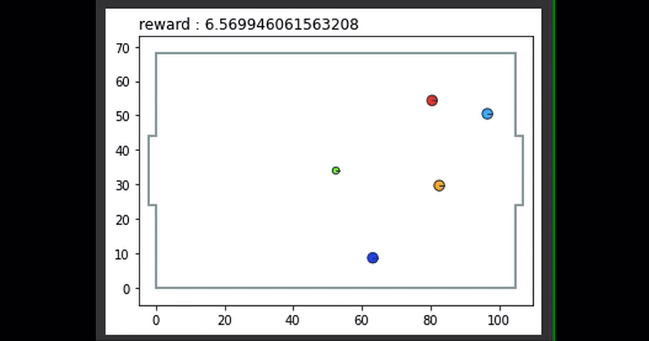

# AI-Robosoccer

* A reinforcement learning environment where agents are trained to play soccer in a primitive 2D simulator. AI players are trained to play with hard-coded opponents. Developed with API from OpenAI's Gym.

* Action space consists of the following actions:
Arrow keys: NOOP[0], UP[1], RIGHT[2], DOWN[3], LEFT[4] 
Action keys: noop[0], dash[1], shoot[2], press[3], pass[4]
Hence an action space of 5x5x(no_of_players_in_a_team).

* The observation space returns the position and velocity of the ball as: [0] x position, [1] y position, [2] x velocity, [3] y velocity.
Hence observation space of 1x4x(no_of_total_players_and ball).

* **The env calculates the reward by measuring the distance of each team from the ball and on hitting a goal and penalizes on hitting outside the goal.**

* The team whose trained model scores highest over a average of 30 episodes run on our server will be declared as the winner. 

Use the colab_notebook to try the environment and train your agents. A sample colab file [startup_guide.ipynb](./startup_guide.ipynb) has been uploaded to guide you on setting the things up. Alternatively you can clone locally and train it.

You can use either of tensorflow or pytorch to visualize your agents. 

## Submission

Upload both the code and the trained policy model to the google form **https://forms.gle/T6qC5T2YpjwGW3ph9**. Please refrain from submitting incomplete codes as this might lead to disqualification of the participant.
The forms will stop accepting responses after 23:59 Hrs IST on 20 March 2021. The winners would be mailed for the further rounds. 

_All the best_ ✌🏻
_Team IEEE BPSC_

**May the best strategy win!!!!!!!!**

## Queries

For any queries, mail us at [ieee.bpsc@gmail.com](mailto:ieee.bpsc@gmail.com).
For technical queries, create an issue in the repository itself. 
